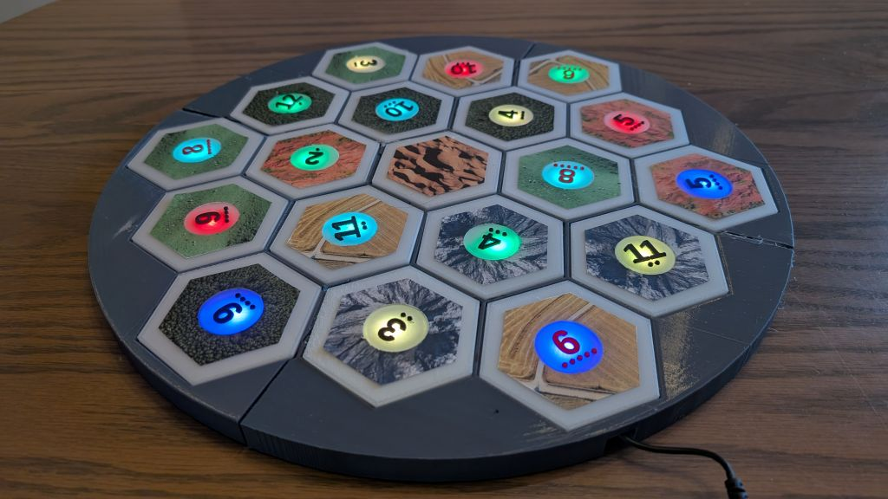
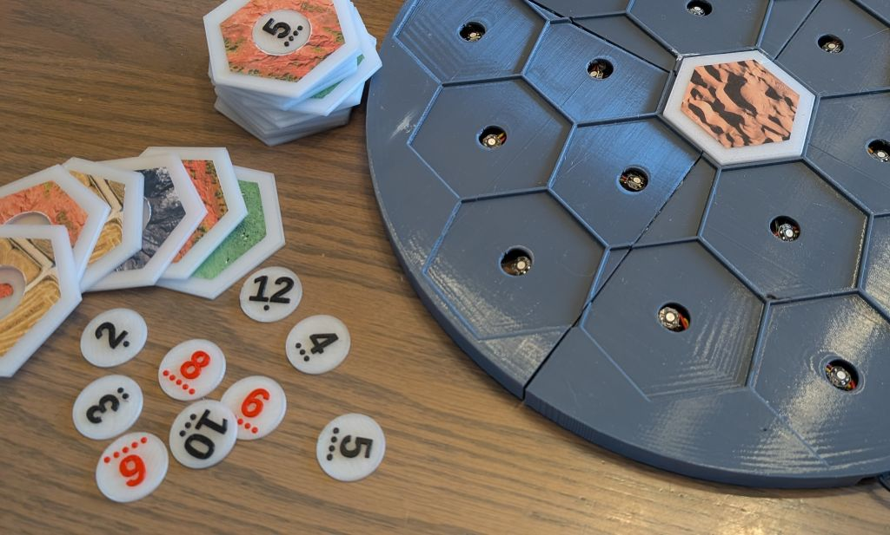
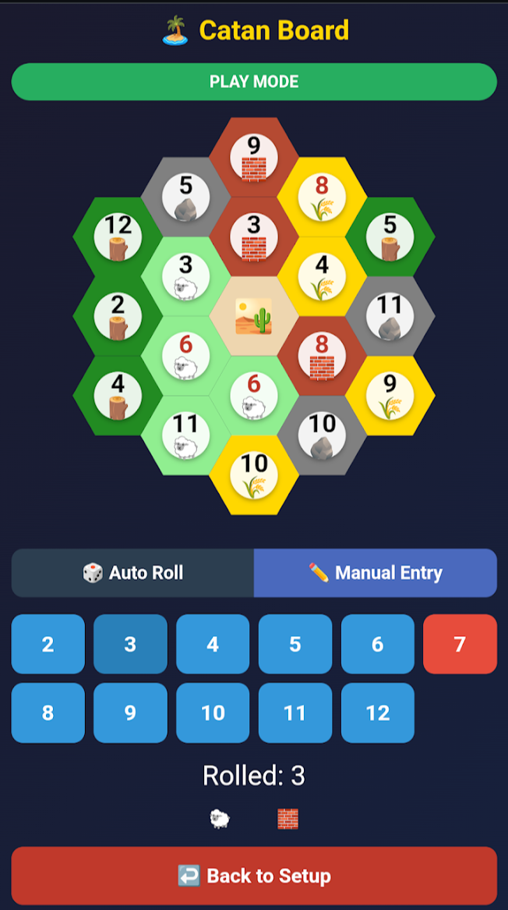
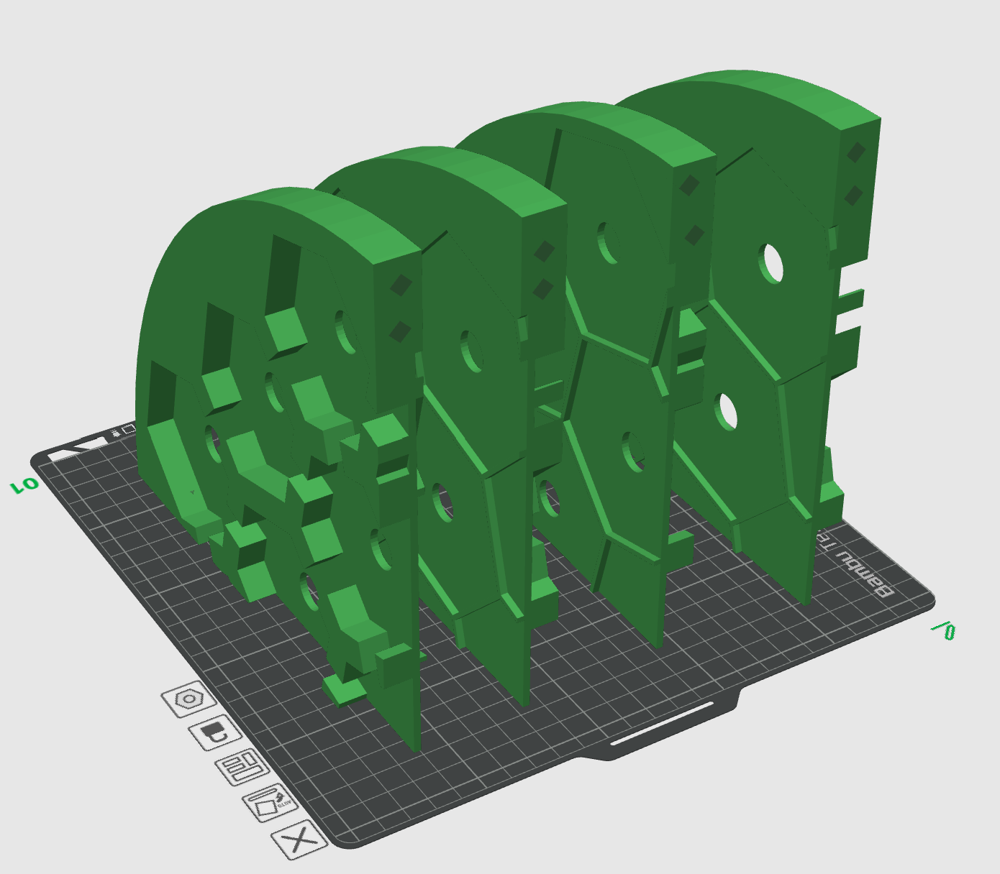
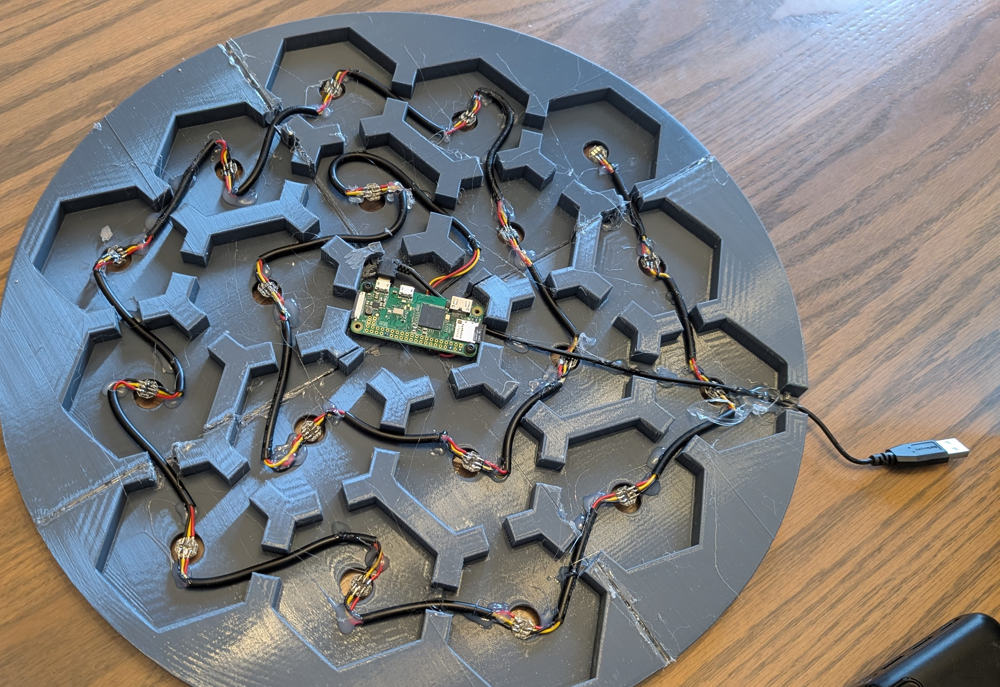

# LED Catan Board

An interactive 3D-printed Catan board with LED-lit hexes controlled by a Raspberry Pi. When you roll the dice, the matching resource hexes light up!





## Features

- **19 hex tiles** with satellite imagery stickers
- **18 addressable LEDs** (one per resource hex, desert has no LED)
- **Web-based controller** - access via phone or computer
- **Randomize board** with standard Catan rules
- **Auto or manual dice rolls** - matching tiles blink when rolled
- **Rainbow startup effect** until first randomization
- **Tap-to-test** individual LEDs during setup

## Hardware Required

| Item | Quantity | Notes |
|------|----------|-------|
| Raspberry Pi Zero W (or Zero 2 W) | 1 | Must have WiFi |
| WS2812B LED pixel modules | 18 | Individual addressable pixels with JST connectors |
| Micro SD card | 1 | 8GB+ recommended |
| USB power bank | 1 | 2A+ output recommended |
| Low Profile Micro USB cable | 1 | For powering the Pi |
| Wire | ~2m | 22-24 AWG, stranded or solid core |
| 3D printer filament | ~500g | PLA for frame and tiles |
| Clear/translucent PLA | ~50g | For number tokens |
| Printable sticker paper | 2 sheets | For hex tile imagery |

## 3D Printed Parts

All models are in the `/models` folder.

### Board (`board.3mf / board-rounded.stl`)

The main board frame with:
- 19 hex recesses for tiles
- 18 LED holes (15mm diameter) in the ledges between hexes
- Wire tunnels connecting all hexes
- Pi Zero W mounting standoffs in center
- USB cable channel

**Print Settings:**
- The full board is ~471mm diameter - too large for most printer
- board.3mf provides pre sliced / quatered board for printing on p1p/p1s
- Glue together after printing



### Hex Tiles - Desert (`tile-desert.stl`)

Central desert time, can be glued in place to hold board together

### Hex Tiles - Resources (`tile.stl`)

Print 18 resource tiles:
- 75mm flat-to-flat
- 3mm thick
- 15mm center hole for LED light
- 30mm recess for number token


### Number Tokens (`all_tokens.scad`)

Print in clear/translucent PLA:
- 29.5mm diameter
- Raised numbers and probability dots
- Standard Catan distribution: 2, 3, 3, 4, 4, 5, 5, 6, 6, 8, 8, 9, 9, 10, 10, 11, 11, 12


## Stickers

The `/stickers` folder contains an HTML template for printing hex stickers.

1. Find satellite imagery for each resource type:
   - **Brick:** Red rock formations, clay quarries
   - **Wood:** Dense forest canopy from above
   - **Sheep:** Green pastures with sheep visible
   - **Wheat:** Golden crop fields
   - **Ore:** Mountain peaks, rocky terrain
   - **Desert:** Sand dunes

2. You can replace the images if you want to change the look `brick.jpg`, `wood.jpg`, `sheep.jpg`, `wheat.jpg`, `ore.jpg`, `desert.jpg`

3. Open `sticker-template.html` in a browser

4. Print on sticker paper at actual size (73mm hexes)

5. Cut out and apply to tiles

## Wiring

### LED Order

Wire the 18 LEDs in series, starting from the inner ring and going counter-clockwise (when looking at the bottom): 

- **Ring 1 (inner):** LED 0-5
- **Ring 2 (outer):** LED 6-17

### Connections

| LED Wire | Pi Connection |
|----------|---------------|
| VCC (5V) | Pin 2 or 4 (5V) |
| GND | Pin 6 (Ground) |
| DIN (Data) | GPIO12 (Pin 32) |

Chain the LEDs: Pi GPIO12 → LED 0 DIN → LED 0 DOUT → LED 1 DIN → ... → LED 17



Hot glue gun the wires in place so the LEDs sit inline with the holes

## Software Setup

### 1. Flash Raspberry Pi OS

1. Download [Raspberry Pi Imager](https://www.raspberrypi.com/software/)
2. Select **Raspberry Pi OS Lite (32-bit)** under "Raspberry Pi OS (other)"
3. Click the gear icon and configure:
   - Hostname: `catan`
   - Enable SSH
   - Set username/password
   - Configure WiFi
4. Flash to SD card

### 2. Install Dependencies

SSH into your Pi:

```bash
ssh pi@catan.local
```

Update and install packages:

```bash
sudo apt update
sudo apt install -y python3-pip python3-flask git
sudo pip3 install rpi_ws281x adafruit-circuitpython-neopixel --break-system-packages
```

### 3. Clone the Repository

```bash
cd ~
git clone https://github.com/gcrate/catan-board.git
cd catan-board
```

### 4. Create Systemd Service

```bash
sudo tee /etc/systemd/system/catanboard.service > /dev/null <<EOF
[Unit]
Description=Catan Board Web Server
After=network.target

[Service]
ExecStart=/usr/bin/python3 /home/pi/catan-board/app.py
WorkingDirectory=/home/pi/catan-board
StandardOutput=inherit
StandardError=inherit
Restart=always
User=root

[Install]
WantedBy=multi-user.target
EOF
```

**Note:** Change `/home/pi/` to `/home/yourusername/` if you used a different username.

### 5. Enable and Start

```bash
sudo systemctl daemon-reload
sudo systemctl enable catanboard
sudo systemctl start catanboard
```

### 6. Access the Web Interface

Open a browser and go to:
```
http://catan.local
```

![Photo: Web interface on phone]
<!-- TODO: Add screenshot of web interface -->

## Usage

### Setup Mode

1. **Rainbow effect** plays on startup
2. Tap **Randomize Board** to generate a valid Catan layout
3. The LEDs will light up with resource colors
4. Tap any hex to flash that LED (for testing)
5. Use **Customize** to adjust resource counts or enable "prevent adjacent 6 & 8"
6. Tap **Start Game** when ready

### Play Mode

Two options for dice rolls:

**Auto Roll:**
- Tap **Roll Dice** to simulate 2d6
- Matching hexes will blink

**Manual Entry:**
- Tap a number button (2-12)
- Use this when rolling physical dice

Tap **Back to Setup** to randomize a new board.

## Troubleshooting

### LEDs not working

1. Check GPIO pin - code uses GPIO12 (Pin 32)
2. Verify ground is connected between Pi and LEDs
3. Make sure data wire goes to DIN (data in), not DOUT
4. Test with a simple script:

```python
import board
import neopixel
pixels = neopixel.NeoPixel(board.D12, 18, brightness=0.5)
pixels.fill((255, 0, 0))  # All red
```

### Web interface not loading

```bash
sudo systemctl status catanboard
sudo journalctl -u catanboard -n 50
```

### Wrong LEDs lighting up

The LED index must match the wiring order. Use setup mode's tap-to-flash feature to verify each position.

## Optional: Hotspot Mode

To use the board without a WiFi network, configure the Pi as a hotspot:

```bash
sudo apt install -y hostapd dnsmasq
```

See [Raspberry Pi hotspot documentation](https://www.raspberrypi.com/documentation/computers/configuration.html#setting-up-a-routed-wireless-access-point) for full setup.

## License

MIT License - feel free to build your own and modify!

## Acknowledgments

This was a quick weekend project - thanks to Claude AI!